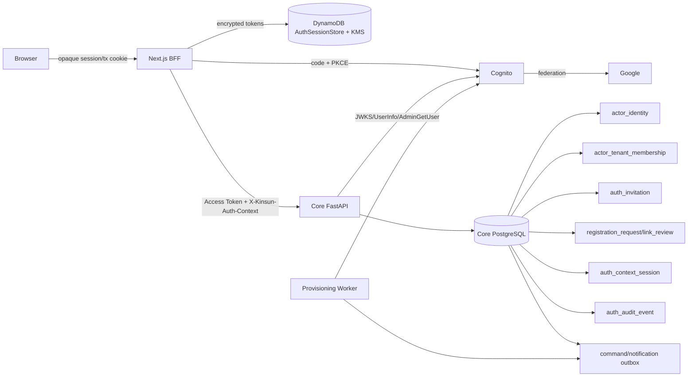

# 技術設計：後端登入與註冊系統

## 0. 決策狀態

本文件是 **Proposed** 設計，不代表 Cognito、Google federation、AWS CDK、AWS Region／Account／Environment 或 DynamoDB／KMS Session Store 已獲 Owner 核准，也不代表下述元件已實作。Repository 目前只有既有 `infrastructure/lib/constructs/auth.ts` Cognito scaffold、Core Cognito 抽象邊界，以及 Next.js BFF access-token cookie seam；concrete token verifier、Google federation、OAuth callback／refresh、server-side Auth Session Store 與正式部署仍是缺口。

進入任何實作 Phase 前，必須先在 Phase 0 比較候選方案與 trade-off，取得 Owner 決策並補齊必要 ADR。若 Owner 選擇不同 IaC、身份供應或 Session Store，本設計與 requirements／tasks 必須先同步修訂，不得以本提案取代決策。

## 1. 架構摘要與不變量

本提案若獲核准，將以 `infrastructure/` 為唯一 canonical infrastructure；Cognito resource ownership 位於 `infrastructure/lib/constructs/auth.ts`，其他 `infrastructure/` 檔案只負責 stack/config/IAM/output/session-store wiring。Google 必須經 Cognito。Core 只接受 Cognito Access Token 作 API authentication，並只從 PostgreSQL Actor/identity/membership 取得業務授權。

信任邊界：

- **Cognito**：password、Google federation、MFA、Email驗證、Access/Refresh/ID Token與native user lifecycle。
- **Next.js BFF**：OAuth code flow、一次性 transaction、ID Token callback validation、server-side encrypted Auth Session、refresh/logout與Core proxy。
- **Core API/PostgreSQL**：Access Token驗證、trusted profile、identity binding、Actor principal、membership/context、Invitation/Pending/Link Review及audit。
- **Worker**：native provisioning/reconciliation與outbox delivery；不授予業務權限。

不可違反的不變量：

1. Email/provider/client body/Token groups不授權；`issuer+sub`只定位identity。
2. `BoundActorPrincipal`不含tenant/role；只有有效Auth Context形成`ActorContext`。
3. Browser沒有raw Access/Refresh/ID Token；Core永不收到ID Token。
4. Bootstrap不回context handle；BFF另呼叫context endpoint。
5. Outbox不是audit；`auth_audit_event`不可變。
6. DB disable/revoke由Core逐request檢查，立即阻擋，不等待Token失效。



## 2. Infrastructure

### 2.1 Ownership與feature gate

`infrastructure/lib/constructs/auth.ts`擁有User Pool、App Client、domain、Google IdP與Cognito設定：

```ts
interface AuthProps {
  envName: string;
  frontendCallbackUrls: string[];
  frontendLogoutUrls: string[];
  domainPrefix: string;
  googleSecretName?: string;
  enableGoogle: boolean;
}
```

- `enableGoogle`預設false；staging通過Core/BFF integration前不得打開，production需額外deployment approval。
- Code grant only、PKCE、scopes `openid email profile`；App Client可登入`COGNITO`，Google只在gate開啟時加入。
- Google secret以Secrets Manager dynamic reference使用，不輸出literal。
- Access Token validity固定最多60分鐘；Refresh Token依營運政策、不得超過30日預設。
- production缺callback/logout/domain/secret時synth fail closed。

其他`infrastructure/`檔案允許且應負責：construct組合、per-environment allowlist、Core/worker IAM、outputs與下述session resources；不得在別處再建User Pool/IdP/App Client。

### 2.2 AuthSessionStore infrastructure

Provision dedicated DynamoDB table與customer-managed KMS key：

- partition key：`item_id`（server-side namespace後的opaque digest或ID）；attribute `item_type=AUTH_SESSION|OAUTH_TRANSACTION|INVITATION_DELIVERY`。
- `INVITATION_DELIVERY`只保存KMS加密的短效raw token；notification outbox只含opaque reference，worker conditional consume後立即刪除。
- TTL attribute只作eventual cleanup；BFF/worker以logical expiry判斷，logout/consume主動conditional delete。
- SSE-KMS、PITR、blocked public access、最小BFF IAM；KMS encryption context至少綁environment與item type。
- OAuth transaction與session可同表不同item type；不得提供Core業務授權查詢。
- CloudWatch/edge/APM redaction需移除`token`、authorization code、cookie與Authorization header。

### 2.3 Cognito administration IAM與outputs

Core profile adapter及worker workload role只取得指定User Pool ARN的必要`AdminGetUser`、`AdminCreateUser`、`AdminDisableUser`、`AdminUserGlobalSignOut`等actions。Browser與一般frontend runtime沒有AWS credential。

非敏感outputs：User Pool ID、Client ID、Issuer、UserInfo、Hosted UI domain。JWKS預設由`<issuer>/.well-known/jwks.json`衍生；若輸出configured URL，Core startup交叉驗證HTTPS host/path/User Pool與issuer一致。

## 3. BFF OAuth、Invitation transaction與Session

### 3.1 Routes

| Method | Route | 行為 |
|---|---|---|
| GET | `/backend/auth/invitations/accept?token=...` | 唯一raw invitation入口；加密暫存後303 clean URL |
| GET | `/backend/auth/login` | 建立state/nonce/PKCE transaction並導向Cognito |
| GET | `/backend/auth/callback` | callback驗證、code exchange、ID Token驗證/丟棄、建立session/bootstrap |
| GET | `/backend/auth/session` | 最小metadata |
| POST | `/backend/auth/refresh` | CSRF-protected explicit refresh（proxy亦可自動refresh） |
| POST | `/backend/auth/context` | 呼叫Core context endpoint，handle只存server-side session |
| POST | `/backend/auth/logout` | 同源CSRF、revoke/sign-out、清context/session後303 |

Callback為cross-site top-level GET，不要求`Origin`；它依exact callback URL、Host allowlist、state/PKCE/nonce保護。所有state-changing POST要求同源`Origin`/`Sec-Fetch-Site`政策與CSRF token。`returnTo`只允許固定relative path allowlist。

### 3.2 Dedicated invitation accept

1. Edge routing先套用query redaction，不將`token`寫入access log/APM/analytics。
2. Route驗證token基本長度/encoding，不查詢或透露Email存在性。
3. 產生opaque transaction ID；以KMS envelope encryption保存raw token，logical TTL預設10分鐘，conditional create。
4. 設`__Host-kinsun_oauth_tx=<opaque id>; Secure; HttpOnly; SameSite=Lax; Path=/`。
5. 回應`Cache-Control: no-store, private`、`Pragma: no-cache`、`Referrer-Policy: no-referrer`、`303 Location: /login`（clean URL）。
6. Login start把同一transaction補入state hash、nonce、PKCE verifier/provider/returnTo，不把raw token放state。
7. Callback以transaction version/state做conditional consume；只有winner可解密token並傳給Core dedicated acceptance資料。任何replay/expiry/tamper拒絕。

Core仍只存invitation token digest；BFF plaintext只存在callback處理記憶體，完成後清除reference。

### 3.3 OIDC callback validation

順序固定：

1. 驗request scheme/Host與configured callback URL完全符合；驗Cognito error欄位與query allowlist。
2. 讀opaque tx cookie，consistent-read transaction；驗state hash、expiry、provider、returnTo與未consume。
3. 以server-side PKCE verifier交換code；token endpoint response套用size/content-type/schema限制。
4. 以Cognito JWKS驗ID Token signature、allowed alg/kid、`iss`、`aud == COGNITO_CLIENT_ID`、`exp`、`iat`（不得在未來超過clock skew且不得早於transaction合理窗口）、`nonce`constant-time一致。
5. ID Token成功後立即捨棄：不寫DynamoDB/cookie/log、不傳Core。失敗則不建立session並consume/invalid transaction。
6. 驗Access/Refresh Token response metadata，建立server session；Access Token只送Core。
7. Callback原子consume transaction；有invite時呼叫Core bootstrap/accept，無invite時bootstrap。
8. Bootstrap `ACTIVE`後，若恰一context descriptor，BFF仍另呼叫context issue endpoint；多個則導向selection。`PENDING`/`IDENTITY_LINK_REVIEW`導向固定頁面。
9. 以303導向allowlisted clean route，所有response `no-store`。

Negative tests必含bad/missing ID Token、signature、iss、aud、exp、future/old iat、nonce、state、PKCE、unknown kid、code replay、Host/redirect mismatch，以及沒有Origin仍可合法callback。

### 3.4 Server-side AuthSessionStore

Production cookies：

| Cookie | Browser內容 | TTL/flags |
|---|---|---|
| `__Host-kinsun_session` | 256-bit opaque session ID | HttpOnly; Secure; SameSite=Lax; Path=/；不設Domain |
| `__Host-kinsun_oauth_tx` | 256-bit opaque transaction ID | 同上；logical TTL 10分鐘；callback後清除 |

DynamoDB session item加密payload包含Access Token、Refresh Token、access/refresh expiry、Core opaque context handle、minimal actor/session metadata；不包含可信tenant/role來源。Session ID需hash/namespace後作key，避免table dump可直接當cookie使用。

- access token與ciphertext logical expiry不晚於`exp`且最多60分鐘；session不晚於refresh expiry（預設30日）。
- DynamoDB TTL非即時，所有讀取先驗logical expiry；logout/expiry主動delete。
- Refresh使用conditional lease：`version`、`refresh_owner`、`refresh_lease_until`。跨instance只有CAS winner呼叫Cognito；winner以version CAS寫新token，loser等待/重讀，不可覆蓋。
- Refresh回應若沒有new refresh token，保留原token；任何terminal invalid_grant刪session並回`SESSION_EXPIRED`。
- Core proxy每次從store解密Access Token；固定以`Authorization: Bearer`與可選`X-Kinsun-Auth-Context`傳遞。Handle不放browser cookie。
- Existing local raw-token seam僅`APP_ENV=development`且explicit flag；production route 404且proxy無fallback。

### 3.5 Logout與disable

`POST /backend/auth/logout`驗same-origin/CSRF後：best-effort撤銷Core context、按session與policy呼叫OAuth revoke及/或`AdminUserGlobalSignOut`、conditional delete session、清兩個opaque cookie，最後303至allowlisted app/Cognito logout URL。不得用DELETE或GET登出。

Access Token即使可在store最多殘留60分鐘，Core逐request查identity/Actor/context/membership；DB disable/revoke在下一request立即拒絕。DynamoDB AuthSessionStore不參與此授權判斷。

## 4. Core authentication與trusted profile

### 4.1 Token模型與設定

Core只接受Access Token：

```text
signature, allowed alg, kid
iss == COGNITO_ISSUER
exp, bounded iat
sub non-empty
token_use == "access"
client_id == COGNITO_CLIENT_ID
```

`aud`是BFF驗ID Token使用，不用於Core Access Token client判斷。Settings含issuer/client ID、derived/cross-checked JWKS、UserInfo、User Pool ID、HTTP timeout、JWKS TTL/stale bound與profile limits。Production任何缺漏startup fail closed。

`VerifiedCognitoIdentity`至少含normalized `issuer`、`subject`及僅供同request profile lookup的raw Access Token封裝；raw token不得進log/domain model。

### 4.2 JWKS與typed failures

JWKS cache限制response size/key count/kty/alg；使用TTL、bounded safe stale與refresh single-flight。Unknown kid只refresh一次：

- refresh成功仍無kid：401。
- refresh因timeout/DNS/TLS/5xx/429/malformed provider response失敗，且cache沒有該key：503。
- 已有未超過safe stale bound且適用的key：可驗證；signature/claim錯仍401。

Exception hierarchy：

```py
ServiceUnavailable
└── AuthenticationProviderUnavailable

AuthenticationError  # credential/semantic profile failure
```

`CognitoAuthenticator`、`get_verified_cognito_identity`、`get_bound_actor_principal`、`get_actor_context`必須先`except (AuthenticationProviderUnavailable, ServiceUnavailable): raise`，不得被broad catch轉成401。FastAPI handlers輸出統一ErrorEnvelope：credential failure 401；provider outage 503、`retryable=true`。Malformed UserInfo transport/schema response屬503；provider明確拒絕token、well-formed response的sub mismatch或strict verified Email不成立屬401。

Production authenticator composition只能在token verifier、trusted profile adapter、Postgres principal/context resolver都存在後啟用。Phase 3只建verifier，不提早接到routes。

### 4.3 Trusted Cognito Profile Adapter

所有Bootstrap都呼叫adapter，不接受BFF provider/email：

```text
TrustedCognitoProfile(
  issuer, subject, provider,
  email_normalized, email_verified=True,
  cognito_username, observed_at
)
```

- **Google**：以同一Access Token呼叫UserInfo，要求`sub`一致、`email_verified` JSON值嚴格為boolean `true`；以受信任Cognito identity metadata/`AdminGetUser`確認federated provider為Google。不得把字串`"true"`當Google boolean。
- **Native**：以User Pool/subject定位`AdminGetUser`，要求Enabled/可登入、native provenance無歧義，`email_verified` Cognito attribute嚴格等於規定字串`true`後轉為boolean；不可把缺值或任意truthy值接受。
- 混合/linked Cognito user需解析provider identity reference；無法唯一證明登入來源時fail closed。Invitation的`allowed_provider`做exact match。
- Adapter可有極短、綁`issuer+sub+token hash`的safe cache；provider不可用且無safe cache為503。一般authorization不靠profile cache。

## 5. Core dependencies與Auth Context

### 5.1 三層dependency

```py
@dataclass(frozen=True)
class BoundActorPrincipal:
    identity_id: UUID
    actor_id: UUID
    actor_type: str
    status: str
```

1. `get_verified_cognito_identity`：只驗Access Token，允許unbound，供Bootstrap。
2. `get_bound_actor_principal`：以`issuer+subject`查`actor_identity`及Actor；不含tenant/role/care-unit。
3. `get_actor_context`：要求fixed `X-Kinsun-Auth-Context` opaque handle，digest lookup並驗exact membership後產生既有`ActorContext`。

Protected admin/business routes不得跳過第2/3層。Bootstrap使用第1層+Trusted Profile；context issue route使用第2層。

### 5.2 Membership與context semantics

現有`actor_tenant_membership`每列定義一個scope：

- `(actor_id, tenant_id, role_code, care_unit_id=NULL)`：只有此列可授予tenant-wide context。
- `(actor_id, tenant_id, role_code, care_unit_id=X)`：只授予X；不可提升tenant-wide。

Context key是`tenant_id+role_code+optional care_unit_id`。單tenant但多role或多scope仍需選；只有一個有效key才可自動選。`auth_context_session`存`role_code`、identity/actor/tenant/care unit、handle digest、status/expiry/version；DB只存digest。

BFF固定傳`X-Kinsun-Auth-Context: <opaque>`；Core不接受`X-Tenant-ID`、role/care-unit claims或明文context ID。每次resolve驗identity/Actor ACTIVE、exact membership status/effective range及context binding。預設不cache authorization；未來cache必須證明同步invalidation與極短上限。

Bootstrap只回authorized context descriptors供UI選擇，不回handle。BFF呼叫`POST /api/v1/me/auth-contexts`取得一次性明文handle並立即加密進server session。

## 6. PostgreSQL資料模型

所有表位於`eldercare_ai` schema，additive Alembic migration。

### 6.1 `actor_identity`

| 欄位 | 說明 |
|---|---|
| `identity_id` UUID PK | internal identity |
| `actor_id` UUID FK | bound Actor |
| `issuer`, `subject` | normalized unique key |
| `provider` | trusted `GOOGLE`/`COGNITO_NATIVE` snapshot |
| `email_snapshot` nullable | verified snapshot，非授權key |
| `status` | `ACTIVE/DISABLED/UNLINKED` |
| `last_seen_at`, timestamps/version | lifecycle |

Constraints：unique(`issuer`,`subject`)；一identity只綁一Actor；Actor可有多個經核准active identities。`Actor.cognito_sub`先dry-run collision，再回填/雙讀，另期移除。

### 6.2 `auth_invitation`與care-unit join

| 欄位 | 說明 |
|---|---|
| `invitation_id`, `token_digest` unique | ID/digest |
| `email_normalized`, `allowed_provider` | acceptance policy |
| `actor_id` nullable, `actor_type` | explicit target/new actor policy |
| `tenant_id`, `role_code` | exact membership |
| `status` | `PROVISIONING/READY/ACCEPTED/REVOKED/EXPIRED/FAILED` |
| `expires_at`, `accepted_identity_id` | lifecycle |
| `provisioning_command_id/version` | worker idempotency |
| `provisioning_attempts`, `next_attempt_at`, `last_error_code` | retry |
| `cognito_username`, `cognito_subject` nullable | reconciliation reference，非Email authorization |
| `created_by_actor_id`, timestamps/version | concurrency/audit reference |

Care units使用join table與FK。只有READY可接受。Google create可直接READY；native由PROVISIONING saga轉READY。

### 6.3 `registration_request`與`identity_link_review`

`registration_request`：`issuer`、`subject`、trusted profile snapshot、status `PENDING/APPROVED/REJECTED/CANCELLED`、untrusted requested entry、`tenant_id=NULL` for uninvited、reviewer/reason、`rejected_until`、version。Unique partial constraint保證每subject最多一active pending。

`identity_link_review`：new issuer/subject/provider、candidate actor、status `PENDING/APPROVED/REJECTED/EXPIRED`、reauth evidence timestamp/digest reference、reviewer/reason/version。不得只因email直接approve；collision以row lock/unique constraints阻擋。

### 6.4 `auth_context_session`

欄位：ID、`handle_digest` unique、identity_id、actor_id、tenant_id、`role_code`、care_unit_id nullable、status、expires/last_seen、version/timestamps。Issue與resolve都需exact membership row。

### 6.5 `auth_audit_event`與outbox

`auth_audit_event`是append-only：event_id/type、occurred_at、result/reason、trace_id、subject/identity/actor IDs、nullable tenant_id、最小JSON metadata、integrity/version欄位。Application DB role只可INSERT/SELECT受限view，不可UPDATE/DELETE；400日預設線上retention後由compliance-controlled archival/deletion job處理。Tenant admin不得查platform/global事件。

Command/notification/domain outbox可重試/標記delivered/清理，只用於可靠傳送；每個敏感狀態交易另寫audit，不以outbox row代替。

## 7. Domain流程

### 7.1 Invitation建立與native provisioning saga

**Google**：admin create transaction驗tenant/role/care-unit→Invitation READY、token digest、audit、KMS加密短效Invitation Delivery item與只含opaque reference的notification outbox。Worker conditional consume delivery item後寄app invitation link並立即刪除明文來源。Native READY notification採相同delivery-reference模式。

**Native**：

```mermaid
sequenceDiagram
  participant A as Admin/Core
  participant D as PostgreSQL
  participant W as Provisioning Worker
  participant C as Cognito
  participant N as Notification Worker

  A->>D: TX Invitation(PROVISIONING)+command outbox+audit
  W->>D: claim command (idempotent)
  W->>C: AdminGetUser / AdminCreateUser
  C-->>W: existing/created user reference
  W->>D: TX READY+notification outbox+audit
  N->>D: claim notification
  N-->>C: Cognito already delivers temporary password; app sends readiness/invite link only
```

Worker不可設定/讀取temporary password；`AdminCreateUser`使用Cognito delivery。Retry以command/invitation key與`AdminGetUser`reconcile，不因相同email建立Core link。Cognito成功但DB失敗時，下一次reconcile取得同user並提交READY。Revoke/expire後，只有可證明由該invite專用建立、未登入/未綁時可delete；其他情況disable+manual review。Bounded retries後FAILED/DLQ，不授權、不通知accept。

### 7.2 Invitation接受

BFF callback原子consume transaction後，把raw invitation token與Access Token送`POST /api/v1/auth/bootstrap`（或同一bootstrap invitation command）。Core：

1. 驗Access Token並取得Trusted Profile。
2. Digest token並row-lock Invitation；要求READY、未過期、provider與strict verified Email match。
3. 檢查`issuer+sub`、Actor/email collision。新subject若對應既有Actor/identity email，不自動link，建立`IDENTITY_LINK_REVIEW`並rollback任何授權。
4. 單一transaction建立/綁Actor、identity、tenant-wide/care-unit memberships、Invitation ACCEPTED與audit；outbox只傳後續event。
5. 回ACTIVE與context descriptors；無handle。

### 7.3 Uninvited pending與approval

所有bootstrap先Trusted Profile。沒有identity/invite/collision則upsert platform-levelPENDING，tenant_id null；requested entry/tenant只是不可信hint。回HTTP202正常payload。

Approval transaction直接建立/選定Actor、identity、exact memberships、APPROVED與audit。下一次bootstrap只resolve。Reject設定`rejected_until`預設30日；期間回rejected狀態/安全403政策，不reopen；期滿才可新建pending。

### 7.4 Identity link/unlink

V1不做Email automatic linking。新subject遇existing actor/identity email只建`IDENTITY_LINK_REVIEW`。Admin approval需：目標Actor explicit、最近10分鐘reauth evidence、重新取得Trusted Profile、鎖candidate/identity/Actor、檢查subject未綁其他Actor，再transaction insert/activate identity與audit。Invitation不得繞過此流程。

Unlink需recent reauth與授權策略、鎖Actor所有active identities；若將成為零則回conflict。成功設UNLINKED/revoke其contexts/sessions通知並audit。Subject collision、provider mismatch、目標Actor不一致皆不變更資料。

## 8. API契約與唯一狀態矩陣

### 8.1 Core routes

| Method | Path | Dependency/說明 |
|---|---|---|
| POST | `/api/v1/auth/bootstrap` | verified identity+Trusted Profile；invite/pending/resolve |
| POST | `/api/v1/me/auth-contexts` | BoundActorPrincipal；issue exact context |
| DELETE | `/api/v1/me/auth-contexts/current` | ActorContext；revoke context |
| GET | `/api/v1/me` | ActorContext |
| POST/GET | `/api/v1/auth/invitations` | authorized admin；create/list |
| POST | `/api/v1/auth/invitations/{id}/resend` | rotate token/notification |
| POST | `/api/v1/auth/invitations/{id}/revoke` | idempotent revoke |
| GET | `/api/v1/auth/registration-requests` | platform review queue |
| POST | `/api/v1/auth/registration-requests/{id}/approve` | transactional finalize |
| POST | `/api/v1/auth/registration-requests/{id}/reject` | cooldown |
| GET/POST | `/api/v1/auth/identity-link-reviews...` | platform/admin review |
| POST | `/api/v1/auth/identities/{id}/unlink` | reauth+last identity guard |

OpenAPI skeleton必須先於routes，並區別verified identity、BoundActorPrincipal與full context security semantics。

Bootstrap response不回handle：

```json
{
  "status": "ACTIVE | PENDING | TENANT_CONTEXT_REQUIRED | IDENTITY_LINK_REVIEW",
  "actor_id": "uuid-or-null",
  "registration_request_id": "uuid-or-null",
  "link_review_id": "uuid-or-null",
  "available_contexts": [
    {"tenant_id":"uuid","role_code":"care_worker","care_unit_id":"uuid-or-null"}
  ]
}
```

Descriptors只列Actor已授權範圍，不能直接當credential。PENDING用202正常schema。

### 8.2 唯一status/error matrix

| HTTP | code/status | 說明 |
|---:|---|---|
| 200 | `ACTIVE/TENANT_CONTEXT_REQUIRED/IDENTITY_LINK_REVIEW` | Bootstrap正常狀態 |
| 202 | `PENDING` | 正常response，非ErrorEnvelope |
| 303 | — | BFF clean redirect/callback/logout |
| 400 | `INVITATION_INVALID` | 無效/不匹配且不安全細分的邀請 |
| 401 | `AUTHENTICATION_REQUIRED` | credential/profile invalid |
| 401 | `SESSION_EXPIRED` | BFF session/refresh terminal failure |
| 403 | `ACCOUNT_DISABLED` | identity/Actor disabled |
| 403 | `REGISTRATION_REJECTED` | cooldown內，不自動reopen |
| 403 | `FORBIDDEN` | 無操作權限 |
| 409 | `IDENTITY_NOT_BOUND` | protected API尚未綁Actor |
| 409 | `IDENTITY_ALREADY_BOUND` | subject/link collision |
| 409 | `INVITATION_CONFLICT` | locked state/Actor/membership collision |
| 409 | `TENANT_CONTEXT_REQUIRED` | 無唯一context或缺header |
| 410 | `INVITATION_EXPIRED` | 過期/撤銷且可安全揭露 |
| 429 | `RATE_LIMITED` | abuse protection |
| 503 | `AUTH_PROVIDER_UNAVAILABLE` | typed provider outage，retryable |

所有錯誤用既有ErrorEnvelope；public routes可為防enumeration降精度，audit保留internal reason。

## 9. 測試與驗證

### 9.1 Infrastructure

CDK assertions驗Cognito resource ownership、code flow/scopes/callback、Google gate、secret不出template/output、dedicated DynamoDB/KMS/TTL/IAM、production缺設定fail closed。Google gate在Core+BFF readiness前必須false。

### 9.2 Core unit/route

- Access JWT：client_id exact、reject ID token/aud-only、iss/exp/iat/token_use/alg/kid/signature。
- JWKS：issuer-derived/cross-check、cache/stale/single-flight/oversize、unknown kid refresh-success-still-unknown=401、refresh outage no key=503。
- UserInfo/AdminGetUser：Google strict boolean、native strict attribute、sub/provider mismatch、token rejection=401；timeout/DNS/5xx/429/malformed transport/schema no cache=503。
- `CognitoAuthenticator`與dependencies re-raise typed outage；FastAPI handlers route-level 401/503 envelope。
- Principal/context：unbound、disabled、單tenant多role/scope、tenant-wide-null、header固定名、digest lookup、membership revoke。
- Invitation/Pending/Link：transactions、race、idempotency、last identity、reauth、cooldown、audit/outbox separation。

### 9.3 BFF

- Invitation URL redaction、no-referrer/no-store、303 clean URL、opaque tx cookie、atomic consume/replay。
- state/PKCE/nonce及全部ID Token negative cases；exact Host/redirect、callback無Origin。
- Browser只有opaque cookies；session ciphertext/KMS boundaries；CAS跨instance refresh。
- POST logout CSRF、revoke/global sign-out、Core context/session deletion、303。
- production raw-token cookie/local injection 404且proxy無fallback。

### 9.4 Worker與staging contracts

Worker tests涵蓋AdminGetUser/Create idempotency、PROVISIONING→READY、DB-after-Cognito failure reconcile、FAILED/DLQ、revoke compensation、Google no-precreate與password non-disclosure。

Staging E2E：

1. Google READY invite→accept route→OAuth callback→bootstrap→context endpoint→`/me`→POST logout。
2. Google uninvited→PENDING→approval transaction→next bootstrap resolve。
3. Native PROVISIONING→READY notification→Cognito temporary-password flow→trusted native profile→bootstrap/context。
4. Google/native strict verified Email/provider/sub contracts與negative cases。
5. 同tenant多role/scope selection、偽造group/role/tenant/header無效、DB disable下一request阻擋。

## 10. Rollout、回滾與營運

依賴順序：additive DB/audit/outbox→session infrastructure/IAM→OpenAPI skeleton→Core verifier/profile→principal/context resolver→production authenticator activation→Invitation/Pending/Link services→native worker→BFF transaction/session/callback→staging E2E→Google feature gate/public entry。

不得在resolver存在前啟用production authenticator，不得在BFF/Core ready前把Google加入有效入口。Dark validation只可驗觀測結果，不可建立授權。

回滾關閉public entry與Google gate、保留User Pool與additive tables、停止worker新command並reconcile in-flight；Core持續fail closed，不回退fake auth/raw-token cookie。Session/KMS incident可使session全部失效，不得繞過Token驗證。

Runbook包含Google/client/JWKS/KMS rotation、Cognito/JWKS/UserInfo outage、native reconciliation/compensation、DLQ、logout-all/disable、audit retention/access與collision處理。

## 11. 已定預設值與部署輸入

已定安全預設：OAuth transaction 10分鐘、recent re-auth 10分鐘、Access Token最多60分鐘、Refresh/session最多30日、rejected cooldown 30日、audit online retention 400日。環境可縮短，不得放寬超過安全審查核准值。

部署前仍需提供的非架構未決輸入：dev/staging/prod frontend domain與exact callback/logout allowlists、Cognito domain prefix、Google credential owner、notification sender/template、ADMIN MFA policy、compliance最終retention例外與production support ownership。
