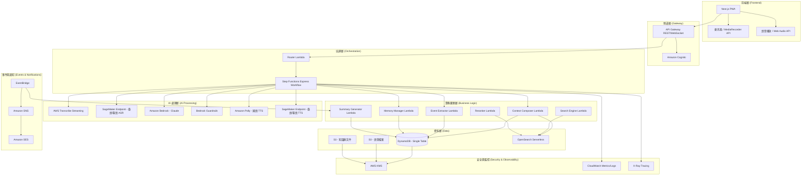
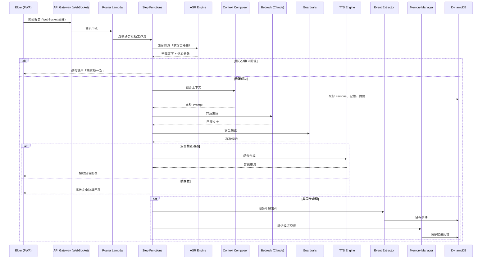
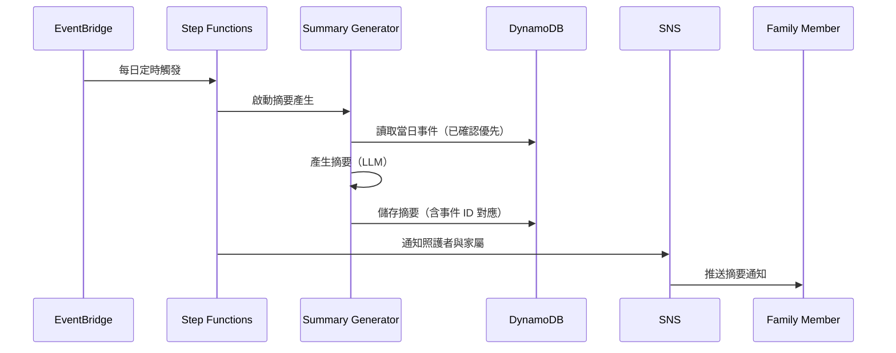
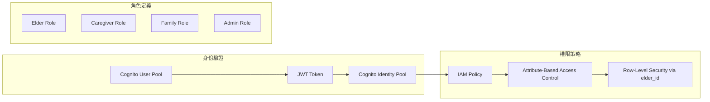
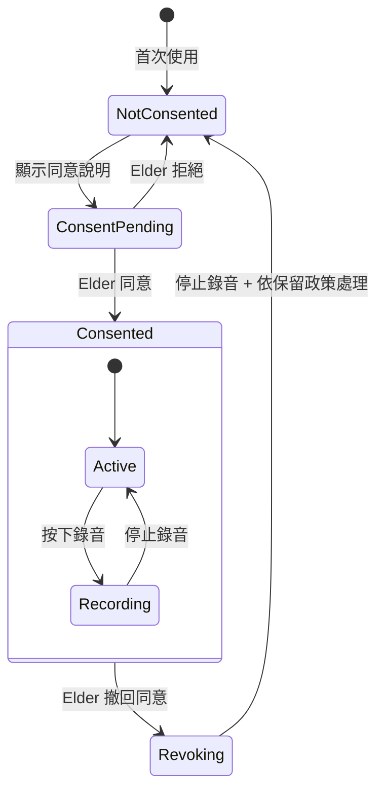

# 技術設計文件：智慧長照 AI 陪伴系統

> **LEGACY SPEC。** 本文件的 Serverless、Lambda、Step Functions、DynamoDB 與舊 Cognito stack 設計已由 [ADR 0007](../../../docs/adr/0007-canonical-backend-and-aws-deployment-authority.md) 取代，不得描述成目前 canonical 架構或已部署能力。現況以 repository 根目錄 [`AGENTS.md`](../../../AGENTS.md) 與 canonical ADR／程式碼為準；歷史完成清單見 [`tasks.legacy.md`](tasks.legacy.md)。

## 概述（Overview）

智慧長照 AI 陪伴系統是一套以語音優先為設計核心的 Progressive Web App（PWA），專為臺灣長照場域中的長者提供自然語言互動陪伴。系統架構採用全 Serverless 設計，以 AWS 雲端服務為基礎建構，透過 Step Functions 協調各處理節點，實現語音辨識、對話生成、事件擷取、記憶管理與衛教知識檢索等核心功能。

### 設計目標

- **低延遲語音互動**：從語音輸入到語音回覆控制在 5 秒內
- **多語言支援**：國語、臺語、客語、英語及混語
- **資料安全**：嚴格的角色權限與資料隔離
- **可觀測性**：端到端 trace ID 追蹤與效能監控
- **彈性擴展**：Serverless 架構自動擴展
- **安全降級**：各節點故障時提供明確的降級回應

### 技術選型決策

| 決策項目 | 選擇 | 理由 |
|---------|------|------|
| 前端框架 | Next.js (PWA) | SSR + PWA 支援、React 生態系 |
| ASR 服務 | AWS Transcribe + SageMaker Endpoint | Transcribe 支援國語串流辨識；臺語/客語由預部署模型處理 |
| LLM | Amazon Bedrock (Claude) | 全託管、支援 Guardrails、無需自行維運 |
| TTS | Amazon Polly + 自建 TTS Endpoint | Polly 支援國語；臺語/客語需自建端點 |
| 資料庫 | DynamoDB (Single-Table Design) | 低延遲、彈性擴展、適合多實體存取模式 |
| 向量搜尋 | OpenSearch Serverless | 支援 Hybrid Search (BM25 + KNN) |
| 工作流 | Step Functions (Express) | 確定性協調、內建重試與錯誤處理 |
| 認證 | Amazon Cognito | 全託管身份驗證、支援多角色 |
| 通知 | Amazon SNS + SES | 多通路推播 |
| 監控 | CloudWatch + X-Ray | 全鏈路追蹤與指標監控 |

## 架構（Architecture）

### 系統架構圖



### 語音互動流程（Voice Interaction Flow）



### 每日摘要流程



## 元件與介面（Components and Interfaces）

### 1. 前端層 — PWA Client

**職責**：語音錄製與播放、UI 狀態管理、WebSocket 通訊

```typescript
// PWA 核心介面
interface VoiceInteractionClient {
  startRecording(): Promise<void>;
  stopRecording(): Promise<AudioBlob>;
  playAudio(audioStream: ReadableStream): Promise<void>;
  getRecordingState(): RecordingState;
}

type RecordingState = 'idle' | 'recording' | 'processing' | 'playing';

interface WebSocketClient {
  connect(token: string): Promise<void>;
  sendAudio(chunk: ArrayBuffer): void;
  onTranscript(callback: (text: string) => void): void;
  onAudioResponse(callback: (audio: ArrayBuffer) => void): void;
  onStateChange(callback: (state: RecordingState) => void): void;
}
```

### 2. 閘道層 — API Gateway

**REST API 端點**：

| 方法 | 路徑 | 說明 | 角色 |
|------|------|------|------|
| POST | /v1/conversations/start | 建立對話 session | Elder |
| GET | /v1/elders/{elderId}/events | 取得事件列表 | Caregiver |
| PUT | /v1/events/{eventId} | 修正事件 | Caregiver |
| GET | /v1/elders/{elderId}/memories | 取得記憶列表 | Elder, Caregiver |
| PUT | /v1/memories/{memoryId}/confirm | 確認記憶 | Elder, Caregiver |
| DELETE | /v1/memories/{memoryId} | 刪除記憶 | Elder, Caregiver |
| GET | /v1/elders/{elderId}/summaries | 取得摘要列表 | Caregiver, Family |
| GET | /v1/caregivers/{caregiverId}/dashboard | 照護者概覽 | Caregiver |
| POST | /v1/search/health | 衛教知識搜尋 | Elder, Caregiver |
| GET | /v1/elders/{elderId}/reports | 週/年報表 | Elder, Caregiver |
| PUT | /v1/elders/{elderId}/persona | 更新 Persona | Caregiver |
| POST | /v1/consent/grant | 授予同意 | Elder |
| POST | /v1/consent/revoke | 撤回同意 | Elder |

**WebSocket API 端點**：

| 路由 | 說明 |
|------|------|
| $connect | 建立 WebSocket 連線（JWT 驗證） |
| $disconnect | 斷開連線 |
| audio | 接收音訊串流 |
| control | 控制指令（開始/停止/取消） |

### 3. 協調層 — Workflow Orchestrator

**Step Functions Express Workflow 定義**：

```typescript
// 語音互動工作流節點定義
interface WorkflowNodeConfig {
  nodeId: string;
  lambdaArn: string;
  inputSchema: JSONSchema;
  outputSchema: JSONSchema;
  timeoutSeconds: number;
  retryPolicy: RetryPolicy;
  fallbackAction: FallbackAction;
}

interface RetryPolicy {
  maxAttempts: number;
  intervalSeconds: number;
  backoffRate: number;
  retryableErrors: string[];
}

type FallbackAction = 
  | { type: 'default_response'; message: string }
  | { type: 'skip_node' }
  | { type: 'notify_and_terminate'; notificationTarget: string };

// 工作流節點清單
const VOICE_INTERACTION_NODES: WorkflowNodeConfig[] = [
  {
    nodeId: 'asr',
    timeoutSeconds: 10,
    retryPolicy: { maxAttempts: 2, intervalSeconds: 1, backoffRate: 2, retryableErrors: ['ServiceUnavailable'] },
    fallbackAction: { type: 'default_response', message: '抱歉，我沒聽清楚，請再說一次' }
  },
  {
    nodeId: 'context_compose',
    timeoutSeconds: 5,
    retryPolicy: { maxAttempts: 1, intervalSeconds: 0, backoffRate: 1, retryableErrors: [] },
    fallbackAction: { type: 'skip_node' }
  },
  {
    nodeId: 'llm_generate',
    timeoutSeconds: 15,
    retryPolicy: { maxAttempts: 2, intervalSeconds: 2, backoffRate: 2, retryableErrors: ['ThrottlingException'] },
    fallbackAction: { type: 'default_response', message: '系統忙碌中，請稍後再試' }
  },
  {
    nodeId: 'guardrail_check',
    timeoutSeconds: 3,
    retryPolicy: { maxAttempts: 1, intervalSeconds: 0, backoffRate: 1, retryableErrors: [] },
    fallbackAction: { type: 'default_response', message: '這個問題建議您諮詢醫師' }
  },
  {
    nodeId: 'tts_synthesize',
    timeoutSeconds: 10,
    retryPolicy: { maxAttempts: 2, intervalSeconds: 1, backoffRate: 2, retryableErrors: ['ServiceUnavailable'] },
    fallbackAction: { type: 'skip_node' } // 降級為文字顯示
  }
];
```

### 4. AI 處理層

#### ASR Engine（語音辨識引擎）

```typescript
interface ASREngine {
  /**
   * 根據語言偏好路由至對應 ASR 服務
   * - 國語/英語: AWS Transcribe Streaming
   * - 臺語/客語: SageMaker Endpoint
   */
  transcribe(audio: AudioStream, config: ASRConfig): Promise<TranscriptionResult>;
}

interface ASRConfig {
  elderId: string;
  preferredLanguage: Language;
  sampleRate: number; // 16000Hz
  encoding: 'pcm' | 'opus';
}

interface TranscriptionResult {
  text: string;
  language: Language;
  confidence: number;
  serviceEndpoint: string;
  modelVersion: string;
  latencyMs: number;
  segments: TranscriptSegment[];
}

type Language = 'zh-TW' | 'nan-TW' | 'hak-TW' | 'en-US' | 'mixed';

interface TranscriptSegment {
  text: string;
  startTime: number;
  endTime: number;
  confidence: number;
  language: Language;
}
```

#### Context Composer（情境組合器）

```typescript
interface ContextComposer {
  compose(request: ContextRequest): Promise<ContextResult>;
}

interface ContextRequest {
  elderId: string;
  currentUtterance: string;
  conversationHistory: ConversationTurn[];
  tokenBudget: number; // e.g., 4096
}

interface ContextResult {
  systemPrompt: string;
  persona: PersonaContext;
  recentSummary: string | null;
  confirmedMemories: ConfirmedMemory[];
  situationalContext: SituationalContext;
  searchResults: SearchResult[] | null;
  usedItems: ContextItem[]; // 追溯用
  totalTokens: number;
}

interface SituationalContext {
  currentTime: string;  // ISO 8601
  dayOfWeek: string;
  weather: WeatherInfo | null;
  recentInteractionCount: number;
  lastInteractionTime: string | null;
}

// Token 預算分配策略
interface TokenBudgetAllocation {
  systemPrompt: number;    // 固定 ~500 tokens
  persona: number;         // 固定 ~200 tokens
  memories: number;        // 動態 ~500 tokens
  recentSummary: number;   // 動態 ~300 tokens
  searchResults: number;   // 動態 ~1000 tokens
  conversationHistory: number; // 剩餘空間
}
```

#### Event Extractor（事件擷取器）

```typescript
interface EventExtractor {
  extract(conversation: ConversationRecord): Promise<ExtractedEvent[]>;
}

interface ExtractedEvent {
  eventId: string;        // ULID
  elderId: string;
  eventType: EventType;
  content: string;        // 結構化描述
  originalUtterance: string;  // 原始對話片段
  eventDate: string;      // ISO 8601
  confidence: number;     // 0.0 - 1.0
  sourceConversationId: string;
  reviewStatus: ReviewStatus;
  createdAt: string;
  metadata: Record<string, unknown>;
}

type EventType = 'meal' | 'activity' | 'sleep' | 'medication_statement' | 'emotion' | 'important_event';
type ReviewStatus = 'auto_approved' | 'needs_review' | 'caregiver_confirmed' | 'caregiver_rejected';
```

#### Memory Manager（記憶管理器）

```typescript
interface MemoryManager {
  generateCandidates(conversation: ConversationRecord): Promise<CandidateMemory[]>;
  confirm(memoryId: string, confirmerId: string): Promise<ConfirmedMemory>;
  reject(memoryId: string, rejecterId: string): Promise<void>;
  retrieve(elderId: string, context: string, limit: number): Promise<ConfirmedMemory[]>;
  delete(memoryId: string, requesterId: string): Promise<void>;
  update(memoryId: string, updates: Partial<MemoryContent>, updaterId: string): Promise<ConfirmedMemory>;
}

interface CandidateMemory {
  memoryId: string;
  elderId: string;
  category: MemoryCategory;
  content: string;
  sourceConversationId: string;
  confidence: number;
  createdAt: string;
  status: 'pending' | 'confirmed' | 'rejected';
}

interface ConfirmedMemory {
  memoryId: string;
  elderId: string;
  category: MemoryCategory;
  content: string;
  confirmedBy: string;   // 確認者 ID
  confirmedAt: string;
  sourceConversationId: string;
  isActive: boolean;
  lastUsedAt: string | null;
}

type MemoryCategory = 'preference' | 'relationship' | 'routine' | 'health_condition' | 'life_event';
```

#### Search Engine & Reranker（搜尋引擎與重排序器）

```typescript
interface SearchEngine {
  search(query: SearchQuery): Promise<SearchResult[]>;
}

interface SearchQuery {
  originalQuestion: string;   // 長者原始口語問題
  reformulatedQuery: string;  // 轉換後的可檢索查詢
  filters: MetadataFilter;
  topK: number;               // 初始檢索數量
}

interface MetadataFilter {
  sourceAgency?: string[];
  serviceType?: string[];
  region?: string[];
  effectiveDateAfter?: string;
  riskLevel?: string[];
  reviewStatus: 'approved';   // 僅搜尋已審核文件
}

interface SearchResult {
  chunkId: string;
  documentId: string;
  content: string;
  sourceAgency: string;
  documentTitle: string;
  publishDate: string;
  bm25Score: number;
  vectorScore: number;
  combinedScore: number;
  metadata: DocumentMetadata;
}

interface Reranker {
  rerank(query: string, results: SearchResult[], persona: PersonaContext): Promise<RankedResult[]>;
}

interface RankedResult extends SearchResult {
  rerankScore: number;
  rankingFactors: {
    queryRelevance: number;
    sourceCredibility: number;
    personaApplicability: number;
    recency: number;
    reviewStatus: number;
  };
}
```

### 5. 通知服務

```typescript
interface NotificationService {
  sendSummary(target: NotificationTarget, summary: DailySummary): Promise<void>;
  sendAlert(target: NotificationTarget, alert: AlertPayload): Promise<void>;
  sendAnomalyNotification(target: NotificationTarget, anomaly: AnomalyInfo): Promise<void>;
}

interface NotificationTarget {
  userId: string;
  role: 'caregiver' | 'family';
  channels: NotificationChannel[];
  preferences: NotificationPreferences;
}

interface NotificationPreferences {
  frequency: 'daily' | 'weekly' | 'realtime';
  quietHoursStart: string; // "22:00"
  quietHoursEnd: string;   // "07:00"
  enabledCategories: string[];
}

type NotificationChannel = 'push' | 'email' | 'sms' | 'line';
```

### 6. Guardrail Engine（護欄引擎）

```typescript
interface GuardrailEngine {
  /**
   * 使用 Bedrock Guardrails ApplyGuardrail API
   * 獨立於模型調用，可對任意文字進行安全檢查
   */
  check(content: string, context: GuardrailContext): Promise<GuardrailResult>;
}

interface GuardrailContext {
  elderId: string;
  conversationType: 'general_chat' | 'health_query' | 'memory_confirmation';
}

interface GuardrailResult {
  allowed: boolean;
  action: 'pass' | 'block' | 'redact';
  blockedCategories: string[];
  redactedContent?: string;
  safetyOverrideMessage?: string; // 緊急情況安全指引
}

// 醫療安全攔截規則
const MEDICAL_GUARDRAIL_TOPICS = [
  'diagnosis',           // 診斷
  'medication_change',   // 停藥/改藥
  'treatment_decision',  // 治療決策
  'dosage_recommendation' // 劑量建議
];

// 緊急情況回應
const EMERGENCY_RESPONSES: Record<string, string> = {
  'chest_pain': '胸口不舒服要趕快打 119 叫救護車，也請家人過來陪您',
  'fall': '跌倒的話先不要亂動，請家人或鄰居來幫忙，需要的話打 119',
  'unconscious': '如果有人意識不清，請立即撥打 119'
};
```

## 資料模型（Data Models）

### DynamoDB Single-Table Design

系統採用 Single-Table Design，以 `PK`（Partition Key）與 `SK`（Sort Key）組合存取多種實體。此設計可減少跨表查詢，符合 DynamoDB 最佳實踐。

#### 主表（Main Table）鍵值設計

| 實體 | PK | SK | 說明 |
|------|----|----|------|
| Elder Profile | `ELDER#{elderId}` | `PROFILE` | 長者基本資料 |
| Persona | `ELDER#{elderId}` | `PERSONA` | 個人化設定 |
| Conversation | `ELDER#{elderId}` | `CONV#{timestamp}#{convId}` | 對話紀錄 |
| Event | `ELDER#{elderId}` | `EVENT#{date}#{eventId}` | 生活事件 |
| Candidate Memory | `ELDER#{elderId}` | `CMEM#{memoryId}` | 候選記憶 |
| Confirmed Memory | `ELDER#{elderId}` | `MEM#{memoryId}` | 已確認記憶 |
| Daily Summary | `ELDER#{elderId}` | `SUM#{date}` | 每日摘要 |
| Consent | `ELDER#{elderId}` | `CONSENT#{type}` | 同意紀錄 |
| Caregiver | `CG#{caregiverId}` | `PROFILE` | 照護者資料 |
| CG-Elder Mapping | `CG#{caregiverId}` | `ELDER#{elderId}` | 照護者-長者對應 |
| Family Member | `FM#{familyId}` | `PROFILE` | 家屬資料 |
| FM-Elder Mapping | `FM#{familyId}` | `ELDER#{elderId}` | 家屬-長者對應 |
| Notification Pref | `FM#{familyId}` | `NOTIF_PREF` | 通知偏好 |
| Audit Log | `AUDIT#{elderId}` | `{timestamp}#{action}` | 稽核紀錄 |

#### GSI 設計

| GSI 名稱 | GSI PK | GSI SK | 用途 |
|----------|--------|--------|------|
| GSI1 | `GSI1PK` | `GSI1SK` | 依事件類型+日期查詢 |
| GSI2 | `GSI2PK` | `GSI2SK` | 依 review_status 查詢 |

- GSI1：`GSI1PK = ELDER#{elderId}#EVENT_TYPE#{type}`, `GSI1SK = {date}`
- GSI2：`GSI2PK = ELDER#{elderId}#REVIEW#{status}`, `GSI2SK = {date}#{eventId}`

#### 核心資料結構

```typescript
// Elder Profile
interface ElderProfile {
  PK: string;          // ELDER#{elderId}
  SK: 'PROFILE';
  elderId: string;
  tenantId: string;
  name: string;
  dateOfBirth: string;
  primaryLanguage: Language;
  secondaryLanguages: Language[];
  consentStatus: ConsentStatus;
  createdAt: string;
  updatedAt: string;
}

// Persona 設定
interface PersonaRecord {
  PK: string;          // ELDER#{elderId}
  SK: 'PERSONA';
  elderId: string;
  displayName: string;       // 系統對長者的稱呼
  preferredLanguage: Language;
  responseLength: 'short' | 'medium' | 'long';
  speakingSpeed: 'slow' | 'normal' | 'fast';
  interactionStyle: 'formal' | 'casual' | 'warm';
  customGreeting: string;
  updatedAt: string;
  updatedBy: string;
}

// 對話紀錄
interface ConversationRecord {
  PK: string;          // ELDER#{elderId}
  SK: string;          // CONV#{timestamp}#{convId}
  conversationId: string;
  elderId: string;
  startTime: string;
  endTime: string | null;
  turns: ConversationTurn[];
  asrMetadata: ASRMetadata;
  status: 'active' | 'completed' | 'failed';
  traceId: string;
  audioS3Key: string | null;
}

interface ConversationTurn {
  role: 'elder' | 'assistant';
  content: string;
  timestamp: string;
  language: Language;
  confidence?: number;
}

interface ASRMetadata {
  serviceEndpoint: string;
  modelVersion: string;
  latencyMs: number;
  language: Language;
}
```

```typescript
// 生活事件
interface EventRecord {
  PK: string;          // ELDER#{elderId}
  SK: string;          // EVENT#{date}#{eventId}
  GSI1PK: string;      // ELDER#{elderId}#EVENT_TYPE#{type}
  GSI1SK: string;      // {date}
  GSI2PK: string;      // ELDER#{elderId}#REVIEW#{status}
  GSI2SK: string;      // {date}#{eventId}
  eventId: string;
  elderId: string;
  eventType: EventType;
  content: string;
  originalUtterance: string;
  eventDate: string;
  confidence: number;
  sourceConversationId: string;
  reviewStatus: ReviewStatus;
  reviewHistory: ReviewChange[];
  createdAt: string;
  updatedAt: string;
  ttl: number;         // DynamoDB TTL for retention policy
}

interface ReviewChange {
  previousValue: string;
  newValue: string;
  changedBy: string;
  changedAt: string;
  field: string;
}

// 記憶（候選/已確認）
interface MemoryRecord {
  PK: string;          // ELDER#{elderId}
  SK: string;          // CMEM#{memoryId} or MEM#{memoryId}
  memoryId: string;
  elderId: string;
  category: MemoryCategory;
  content: string;
  sourceConversationId: string;
  confidence: number;
  status: 'pending' | 'confirmed' | 'rejected' | 'deleted';
  confirmedBy: string | null;
  confirmedAt: string | null;
  isActive: boolean;
  lastUsedAt: string | null;
  createdAt: string;
  updatedAt: string;
  auditTrail: AuditEntry[];
  ttl: number;
}

interface AuditEntry {
  action: 'created' | 'confirmed' | 'rejected' | 'updated' | 'deactivated' | 'deleted';
  performedBy: string;
  performedAt: string;
  details: string;
}

// 每日摘要
interface SummaryRecord {
  PK: string;          // ELDER#{elderId}
  SK: string;          // SUM#{date}
  summaryId: string;
  elderId: string;
  date: string;
  content: SummaryContent;
  sourceEventIds: string[];
  generatedAt: string;
  version: number;
}

interface SummaryContent {
  overview: string;
  meals: string[];
  activities: string[];
  sleep: string | null;
  medicationStatements: string[];
  importantEvents: string[];
  emotionalState: string | null;
}
```

### OpenSearch Serverless 索引設計

#### 衛教知識庫索引（health-knowledge）

```json
{
  "mappings": {
    "properties": {
      "chunk_id": { "type": "keyword" },
      "document_id": { "type": "keyword" },
      "content": { "type": "text", "analyzer": "ik_max_word" },
      "content_vector": { "type": "knn_vector", "dimension": 1024 },
      "source_agency": { "type": "keyword" },
      "document_title": { "type": "text" },
      "service_type": { "type": "keyword" },
      "region": { "type": "keyword" },
      "effective_date": { "type": "date" },
      "expiry_date": { "type": "date" },
      "risk_level": { "type": "keyword" },
      "review_status": { "type": "keyword" },
      "version": { "type": "keyword" },
      "chunk_index": { "type": "integer" },
      "total_chunks": { "type": "integer" },
      "created_at": { "type": "date" },
      "updated_at": { "type": "date" }
    }
  }
}
```

#### 記憶向量索引（memory-vectors）

```json
{
  "mappings": {
    "properties": {
      "memory_id": { "type": "keyword" },
      "elder_id": { "type": "keyword" },
      "content": { "type": "text" },
      "content_vector": { "type": "knn_vector", "dimension": 1024 },
      "category": { "type": "keyword" },
      "is_active": { "type": "boolean" },
      "created_at": { "type": "date" }
    }
  }
}
```

### S3 儲存結構

```
s3://elderly-care-audio-{env}/
├── audio/{elder_id}/{date}/{conversation_id}.opus
└── transcripts/{elder_id}/{date}/{conversation_id}.json

s3://elderly-care-knowledge-{env}/
├── raw/{source_agency}/{document_id}/original.*
├── processed/{document_id}/
│   ├── manifest.json
│   ├── chunks.jsonl
│   └── metadata.json
└── embeddings/{document_id}/vectors.npy

s3://elderly-care-exports-{env}/
└── reports/{elder_id}/{report_type}/{date}.json
```

### 資料保留政策

| 資料類型 | 保存期限 | 刪除方式 |
|---------|---------|---------|
| 語音檔案 | 90 天 | S3 Lifecycle Policy |
| 對話紀錄 | 1 年 | DynamoDB TTL |
| 生活事件 | 2 年 | DynamoDB TTL |
| 已確認記憶 | 無限（可手動刪除） | 手動刪除 |
| 候選記憶（未確認） | 30 天 | DynamoDB TTL |
| 每日摘要 | 2 年 | DynamoDB TTL |
| 稽核紀錄 | 3 年 | DynamoDB TTL |
| 知識庫文件 | 無限（可版本管理） | 手動標記失效 |

## 正確性特性（Correctness Properties）

*正確性特性（Property）是指在系統所有合法執行路徑中都應成立的行為特徵——本質上是對系統行為的形式化陳述。Properties 是人類可讀的規格與機器可驗證的正確性保證之間的橋樑。*

### Property 1：ASR 語言路由正確性

*對任何*語言偏好設定與偵測到的語言組合，ASR Engine 的路由決策必須將國語/英語導向 AWS Transcribe，將臺語/客語導向 SageMaker Endpoint，且永不將任何語言導向不支援該語言的端點。

**驗證需求：A02.1**

### Property 2：信心分數閾值分類

*對任何*信心分數值，當分數低於設定閾值時，系統必須觸發對應的降級行為（ASR 層：請求重說；事件擷取層：標記為 needs_review）；當分數高於或等於閾值時，系統必須正常處理。

**驗證需求：A02.2, B01.5**

### Property 3：有限重試上界

*對任何*工作流執行中的錯誤序列，單一節點的重試次數永遠不超過該節點配置的 maxAttempts，且整個互動的總重試次數永遠不超過系統全域上限。

**驗證需求：A02.5, A05.2**

### Property 4：Context Composer Token 預算約束

*對任何*可用的上下文項目集合（Persona、記憶、摘要、搜尋結果、對話歷史）與任何 Token 預算值，Context Composer 產出的完整 Prompt 之 Token 數永遠不超過預算，且 usedItems 清單精確反映實際被納入的項目。

**驗證需求：A04.1, J02.2, J02.3**

### Property 5：僅已確認記憶作為事實

*對任何*包含已確認記憶與候選記憶的混合集合，Context Composer 在建構事實區段時，產出的 Prompt 中僅包含狀態為 confirmed 的記憶，候選記憶永遠不會出現在事實引用區段。

**驗證需求：A04.2**

### Property 6：結構化輸出 Schema 驗證閘門

*對任何*由 Event Extractor 或 Memory Manager 產生的結構化 JSON 輸出，必須通過對應的 JSON Schema 驗證後才寫入 DynamoDB；不符合 Schema 的輸出永遠不會被持久化。

**驗證需求：B01.2, J03.1**

### Property 7：實體必要欄位完整性

*對任何*被持久化的事件（Event）或候選記憶（Candidate Memory），必須包含所有必要欄位：事件需包含 eventDate、eventType、originalUtterance、confidence、sourceConversationId；候選記憶需包含 sourceConversationId、createdAt、confidence。

**驗證需求：B01.4, D01.3**

### Property 8：摘要內容可追溯性

*對任何*由 Summary Generator 產生的摘要，摘要中每一項內容描述都必須對應至少一個有效的原始事件 ID（sourceEventIds），且該事件 ID 確實存在於資料庫中。

**驗證需求：B02.3**

### Property 9：修改稽核完整性

*對任何*由 Caregiver 對事件或記憶執行的修改操作，系統必須在 reviewHistory/auditTrail 中記錄修改前的值、修改後的值、修改者 ID 與修改時間戳記，且記錄不可被後續操作覆蓋。

**驗證需求：B03.2**

### Property 10：拒絕的記憶永不持久化為已確認

*對任何*被 Elder 或 Caregiver 拒絕的候選記憶，該記憶的狀態必須為 rejected，且後續對已確認記憶的檢索永遠不會返回該記憶。

**驗證需求：D02.2**

### Property 11：Elder 級資料隔離

*對任何*資料存取請求（API 層與資料層），返回的所有資料項目的 elder_id 必須與請求者被授權存取的 elder_id 完全一致。不同 elder_id 的資料永遠不會在單一查詢結果中混合出現。

**驗證需求：D03.2, H01.3**

### Property 12：刪除操作跨儲存完整性

*對任何*資料刪除操作（記憶刪除、資料保留到期），系統必須同步從所有儲存位置（DynamoDB、S3、OpenSearch 索引）移除對應資料。刪除完成後，從任何儲存位置的查詢都不應返回已刪除的資料。

**驗證需求：D04.2, H03.3**

### Property 13：搜尋結果有效性過濾

*對任何*衛教知識搜尋查詢，返回的搜尋結果中不包含 review_status 為 needs_review 的文件，也不包含 effective_date 已過期的文件。僅已審核且有效的文件才出現在結果中。

**驗證需求：E02.2, E02.3**

### Property 14：搜尋結果去重

*對任何* BM25 與 Vector KNN 合併後的搜尋結果集合，不存在兩個具有相同 chunk_id 的結果項目，且每個結果保留其來源分數（bm25Score 與 vectorScore）。

**驗證需求：E03.2**

### Property 15：Reranker Top-N 截斷

*對任何*經過 Reranker 排序的結果集合，送入 LLM Engine 的結果數量恰好為 min(N, 可用結果數)，且送入的結果確實是排序分數最高的前 N 筆。

**驗證需求：E04.2**

### Property 16：Trace ID 傳播一致性

*對任何*完整的語音互動流程，從 API Gateway 接收請求到所有後續處理階段（ASR、Context Compose、LLM、Guardrail、TTS、Event Extract），所有階段的日誌記錄必須包含相同的 trace ID。

**驗證需求：J04.2**

### Property 17：監控日誌 PII 去除

*對任何*寫入 CloudWatch 的日誌記錄，不包含長者的對話逐字稿原文、姓名、身分證號或其他定義為 PII 的欄位值。日誌中僅包含事件 ID、trace ID 等非敏感識別碼。

**驗證需求：J04.3**

## 錯誤處理（Error Handling）

### 錯誤分類與處理策略

| 錯誤類別 | 範例 | 處理策略 | 使用者體驗 |
|---------|------|---------|-----------|
| 暫時性服務錯誤 | ASR/TTS/LLM 逾時 | 指數退避重試 → 降級回應 | 語音提示「稍後再試」 |
| ASR 辨識不佳 | 信心分數過低 | 請求重說（最多 2 次） | 語音提示「請再說一次」 |
| 安全護欄攔截 | 醫療建議類內容 | 替換為安全回應 | 語音提示就醫建議 |
| Schema 驗證失敗 | 事件擷取格式錯誤 | 丟棄該筆、記錄日誌 | 無感知（背景處理） |
| 權限錯誤 | 跨 Elder 存取 | 拒絕請求、記錄告警 | 403 錯誤頁面 |
| 緊急情境偵測 | 胸痛、跌倒關鍵字 | 立即回應安全指引 | 緊急提示 + 通知家屬 |
| 連線中斷 | WebSocket 斷線 | 自動重連 + 本地暫存 | UI 顯示重連狀態 |

### 降級回應機制

```typescript
interface DegradedResponse {
  type: 'prerecorded_audio' | 'static_text' | 'text_only';
  content: string;
  audioUrl?: string;   // 預錄語音 S3 URL
  retryAfterSeconds: number;
}

// 各元件降級策略
const DEGRADATION_STRATEGIES: Record<string, DegradedResponse> = {
  'asr_timeout': {
    type: 'prerecorded_audio',
    content: '抱歉，我沒聽清楚，請再說一次好嗎？',
    audioUrl: 's3://assets/fallback/retry-please.mp3',
    retryAfterSeconds: 0
  },
  'llm_timeout': {
    type: 'prerecorded_audio',
    content: '系統正在忙碌，請等我一下再跟我說話喔',
    audioUrl: 's3://assets/fallback/system-busy.mp3',
    retryAfterSeconds: 5
  },
  'tts_failure': {
    type: 'text_only',
    content: '（顯示文字回覆於畫面）',
    retryAfterSeconds: 0
  },
  'all_retries_exhausted': {
    type: 'prerecorded_audio',
    content: '不好意思，系統目前有點問題，請稍後再來找我聊天',
    audioUrl: 's3://assets/fallback/come-back-later.mp3',
    retryAfterSeconds: 60
  }
};
```

### 連續失敗偵測與通知

```typescript
interface FailureTracker {
  /**
   * 記錄每次互動結果
   * 當連續失敗達到閾值（3次）時觸發通知
   */
  recordInteractionResult(elderId: string, success: boolean): Promise<void>;
  getConsecutiveFailureCount(elderId: string): Promise<number>;
}

const FAILURE_NOTIFICATION_THRESHOLD = 3;
```

### 錯誤日誌格式

```typescript
interface ErrorLog {
  traceId: string;
  timestamp: string;
  component: string;    // 'asr' | 'llm' | 'tts' | 'context' | 'event_extractor' | 'memory'
  errorType: string;    // 'timeout' | 'service_error' | 'validation_error' | 'permission_denied'
  errorCode: string;
  message: string;      // 不含 PII
  elderId: string;      // 僅記錄 ID，不記錄姓名
  retryAttempt: number;
  resolved: boolean;
  fallbackAction: string;
}
```

## 測試策略（Testing Strategy）

### 雙軌測試方法

本系統採用單元測試與屬性測試（Property-Based Testing）互補的雙軌方法：

- **單元測試**：驗證特定場景、邊界條件與錯誤處理
- **屬性測試**：驗證跨所有輸入空間的通用正確性特性

### 屬性測試配置

- **測試框架**：fast-check（TypeScript/JavaScript）
- **每個屬性最少執行 100 次迭代**
- **每個屬性測試必須標註對應的設計文件 Property 編號**
- **標記格式**：`Feature: elderly-care-ai-companion, Property {N}: {property_text}`

### 屬性測試涵蓋範圍

| Property # | 測試目標 | 生成器策略 |
|-----------|---------|-----------|
| 1 | ASR 語言路由 | 隨機生成語言代碼組合 |
| 2 | 信心分數閾值 | 隨機生成 0.0-1.0 浮點數 |
| 3 | 有限重試上界 | 隨機生成錯誤序列 |
| 4 | Token 預算約束 | 隨機生成不同大小的 context items |
| 5 | 僅確認記憶為事實 | 隨機生成混合狀態的記憶集合 |
| 6 | Schema 驗證閘門 | 隨機生成合法/非法 JSON 結構 |
| 7 | 必要欄位完整性 | 隨機生成缺少不同欄位的實體 |
| 8 | 摘要可追溯性 | 隨機生成事件集合與對應摘要 |
| 9 | 修改稽核完整性 | 隨機生成修改操作序列 |
| 10 | 拒絕記憶不持久化 | 隨機生成確認/拒絕操作 |
| 11 | Elder 資料隔離 | 隨機生成多 Elder 資料與跨 Elder 查詢 |
| 12 | 刪除跨儲存完整性 | 隨機生成跨多儲存位置的資料項目 |
| 13 | 搜尋結果有效性過濾 | 隨機生成混合狀態/日期的文件集合 |
| 14 | 搜尋結果去重 | 隨機生成有重疊的 BM25/KNN 結果 |
| 15 | Reranker Top-N 截斷 | 隨機生成不同長度的排序結果 |
| 16 | Trace ID 傳播 | 隨機生成多階段處理流程 |
| 17 | PII 去除 | 隨機生成包含 PII 模式的日誌內容 |

### 單元測試重點

| 測試類別 | 測試項目 | 範例 |
|---------|---------|------|
| API 端點 | 各 REST/WebSocket 端點的正常與錯誤回應 | POST /conversations/start 成功回傳 session ID |
| 權限控制 | 各角色的存取權限驗證 | Caregiver 無法存取非負責 Elder 的資料 |
| 降級回應 | 各元件逾時/錯誤時的降級行為 | LLM 逾時回傳預設語音 |
| 緊急偵測 | 緊急關鍵字觸發安全指引 | 「胸口痛」觸發 119 指引 |
| 護欄攔截 | 醫療安全內容攔截 | 包含「停藥」建議被攔截 |
| 同意管理 | 同意撤回後的行為變更 | 撤回同意後不錄音 |

### 整合測試

| 測試場景 | 涵蓋元件 | 驗證重點 |
|---------|---------|---------|
| 端到端語音對話 | PWA → API GW → SF → ASR → LLM → TTS | 完整流程在 5 秒內完成 |
| 事件擷取與摘要 | 對話 → Event Extractor → DynamoDB → Summary Generator | 事件正確擷取並出現在摘要中 |
| 記憶確認流程 | 對話 → Memory Manager → 確認 → 檢索 | 確認後記憶可被正確檢索引用 |
| 衛教 RAG 查詢 | 問題 → Search Engine → Reranker → LLM → 有來源回答 | 回答包含來源引用且不含過期文件 |
| 連續失敗通知 | 3 次失敗 → FailureTracker → SNS → 通知 | 第 3 次失敗後觸發通知 |

### 安全測試

| 測試類型 | 測試項目 |
|---------|---------|
| 權限邊界 | 嘗試跨 Elder 存取、未授權角色操作 |
| 注入防護 | Prompt Injection 嘗試、SQL/NoSQL 注入 |
| 加密驗證 | HTTPS 強制、KMS 加密驗證 |
| PII 洩漏 | 日誌中 PII 掃描、回應中 PII 遮罩 |
| 同意合規 | 未同意時的資料處理行為 |

### 效能測試基線

| 指標 | 目標值 |
|-----|--------|
| 語音互動端到端延遲 | < 5 秒 |
| ASR 辨識延遲 | < 2 秒 |
| LLM 回覆生成延遲 | < 3 秒 |
| TTS 合成延遲 | < 1.5 秒 |
| 搜尋查詢延遲 | < 1 秒 |
| API Gateway 回應時間 | < 200ms（不含下游） |

## 安全架構（Security Architecture）

### 認證與授權



#### 角色權限矩陣

| 資源 | Elder | Caregiver | Family | Admin |
|------|-------|-----------|--------|-------|
| 自己的對話紀錄 | 讀 | 讀 | — | 讀 |
| 自己的事件 | 讀 | 讀/寫 | — | 讀 |
| 自己的記憶 | 讀/確認/刪除 | 讀/寫/確認 | — | 讀 |
| 每日摘要 | 讀（語音） | 讀 | 讀（通知版） | 讀 |
| Persona 設定 | — | 讀/寫 | — | 讀/寫 |
| 其他 Elder 資料 | ❌ | 僅負責者 | 僅關聯者 | 全部 |
| 知識庫管理 | — | — | — | 讀/寫 |
| 系統設定 | — | — | — | 讀/寫 |

### 資料隔離機制

```typescript
// API 層隔離 - Lambda Authorizer
interface AuthorizationContext {
  userId: string;
  role: UserRole;
  authorizedElderIds: string[]; // 可存取的 Elder ID 清單
  tenantId: string;
}

// 每個 API 請求都經過此驗證
function validateDataAccess(
  authContext: AuthorizationContext,
  requestedElderId: string
): boolean {
  return authContext.authorizedElderIds.includes(requestedElderId);
}

// DynamoDB 條件式存取
// 所有查詢強制加入 elder_id 條件
interface DynamoDBAccessPolicy {
  conditionExpression: 'PK = :pk AND begins_with(SK, :prefix)';
  // PK 永遠包含 elder_id，防止跨使用者存取
}
```

### 加密策略

| 層級 | 機制 | 金鑰管理 |
|------|------|---------|
| 傳輸中 | TLS 1.2+ (HTTPS) | ACM 憑證自動輪換 |
| 靜態儲存 - DynamoDB | AWS 管理金鑰 (SSE-KMS) | KMS CMK |
| 靜態儲存 - S3 | SSE-KMS | KMS CMK |
| 靜態儲存 - OpenSearch | 節點加密 | KMS CMK |
| 應用層敏感資料 | 欄位級加密 | KMS Data Key |

### 同意管理流程



### 醫療安全邊界

```typescript
// Bedrock Guardrails 配置
interface MedicalGuardrailConfig {
  guardrailId: string;
  version: string;
  deniedTopics: string[];          // 診斷、停藥、改藥、治療決策
  contentFilters: ContentFilter[];
  sensitiveInfoFilters: string[];  // PII 類型
  emergencyPatterns: EmergencyPattern[];
}

interface EmergencyPattern {
  keywords: string[];              // ['胸痛', '胸口痛', '心臟痛']
  response: string;                // 固定安全指引
  notifyFamily: boolean;
  severity: 'critical' | 'high' | 'medium';
}

// 護欄測試案例集結構
interface GuardrailTestCase {
  id: string;
  input: string;
  expectedAction: 'pass' | 'block';
  category: string;
  description: string;
}
```

### 監控與告警

| 指標 | 告警閾值 | 通知目標 |
|------|---------|---------|
| API 5xx 錯誤率 | > 5% (5min) | DevOps Team |
| 跨 Elder 存取嘗試 | > 0 | Security Team |
| Guardrail 攔截率 | > 20% (1hr) | AI Team |
| ASR 連續失敗 | ≥ 3 次/Elder | Caregiver + Family |
| Lambda 逾時率 | > 10% (5min) | DevOps Team |
| DynamoDB 節流 | > 0 (1min) | DevOps Team |

---

## 附錄：關鍵設計決策記錄

### 決策 1：Single-Table vs Multi-Table DynamoDB

**選擇**：Single-Table Design

**理由**：
- 照護者概覽頁需在單一查詢中取得多種實體（事件數、最後互動、摘要狀態）
- 減少跨表交易的複雜性
- Elder 的所有資料以 `ELDER#{elderId}` 為 PK，天然實現資料隔離
- GSI 可支援按類型、狀態的次要查詢模式

### 決策 2：WebSocket vs REST for 語音互動

**選擇**：WebSocket API（語音串流）+ REST API（管理操作）

**理由**：
- 語音互動需要雙向即時通訊（送音訊、收轉譯結果與語音回覆）
- REST API 適合照護者/家屬的非即時操作
- WebSocket 可維持連線狀態，避免每次互動重新建立連線的延遲

### 決策 3：Step Functions Express vs Standard

**選擇**：Express Workflow

**理由**：
- 語音互動需要低延遲（< 5 秒端到端）
- Express Workflow 支援同步執行，適合即時回應場景
- 每次互動為短暫處理（< 30 秒），不需 Standard 的長時間執行支援
- 成本以執行次數計費，適合高頻互動場景

### 決策 4：Bedrock Guardrails 獨立 API vs 模型內建

**選擇**：使用 ApplyGuardrail API 獨立調用

**理由**：
- 可對任意文字執行安全檢查，不限於模型輸出
- 可在 Step Functions 中作為獨立節點，失敗不影響其他處理
- 支援對使用者輸入（Prompt Injection 防護）與模型輸出（醫療安全）分別檢查
- 便於維護護欄測試案例集

### 決策 5：OpenSearch Serverless vs Bedrock Knowledge Base

**選擇**：自建 OpenSearch Serverless 搜尋管線

**理由**：
- 需要自定義 Metadata Filtering（source_agency、region、risk_level 等）
- 需要自定義 Reranker 邏輯（結合 Persona 適用度）
- 需要維護可量化的搜尋品質測試集
- Bedrock Knowledge Base 的 Hybrid Search 尚不支援如此細緻的 metadata 過濾
