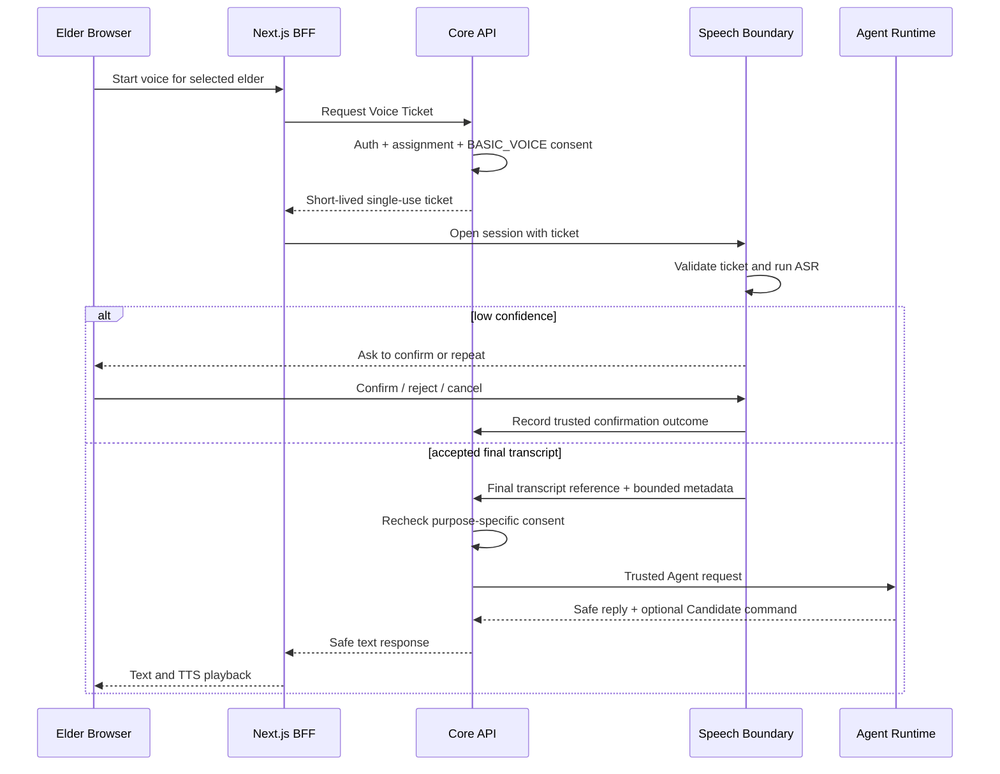
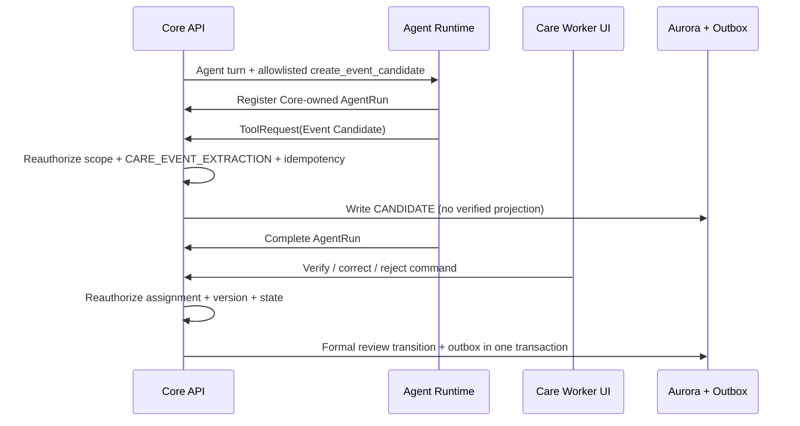
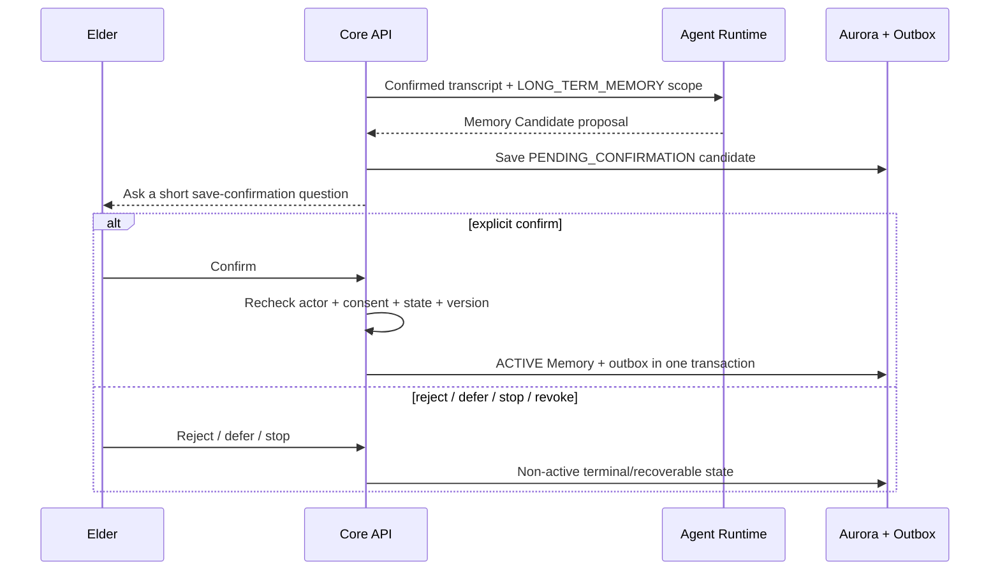
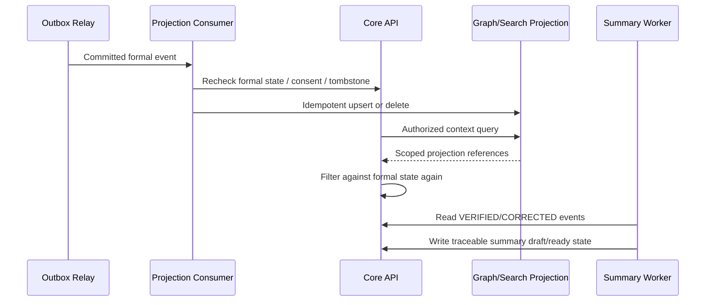

# Design Document: Gate 1 Agent Vertical Slice

## 1. Overview

本設計把 `requirements.md` 的 Gate 1 需求落在 ADR 0007 的唯一 canonical topology：

```text
Browser
  → packages/frontend（唯一 multi-role PWA／BFF）
    → services/core-api（唯一 Domain／Authorization／Consent／Command Gate）
      → Aurora PostgreSQL（正式狀態與 transactional outbox）
      → services/agent-runtime（private、受控 Agent Runtime）
      → canonical speech boundary（待 Owner 決策與實作）
      → outbox relay／projection／summary workers（待實作）
```

`packages/backend`、legacy Lambda／DynamoDB／Step Functions 與舊 WebSocket token flow 不在本
設計內。OpenSearch、Neptune、cache 與 Agent memory 都是可重建 projection／working state，
不能做授權或正式狀態來源。

本文件只描述 Gate 1 目標與增量設計。已存在能力列為 baseline，不會在 `tasks.md` 補登完成；
尚未實作的 API／event／schema 不會提前加入 executable `contracts/`。

## 2. Design Goals

1. 先完成安全、可展示、可恢復的單一林阿嬤 Vertical Slice。
2. 所有正式狀態轉換只經 Core Command Gate。
3. Event／Memory 永遠先是 Candidate，人工 Gate 不可由模型或 retry 取代。
4. 授權、Consent、刪除與撤回 fail closed，且優先於 replay／projection。
5. 正式寫入與 outbox 同交易，Projection 可重建且不得 dual write。
6. 每個摘要與 Context reuse 都可追蹤來源。
7. 正常路徑與 failure path 都能以 Synthetic data 重跑。

## 3. Non-Goals

- 不做 production deployment 或宣稱 ECS application 已上線。
- 不在 Gate 1 導入通用 multi-Agent debate、自由 Tool loop 或 cross-agent handoff。
- 不做 Wave 3 RAG 擴充、陪伴需求訊號、主動陪伴、Family notification 或 English path。
- 不使用 Draft Family Report、未覆核 Event 或未確認 Memory 驅動任何對外內容。
- 不選定尚未經 Owner 核准的 ASR／TTS、Bedrock model 或 Graph production provider。

## 4. Current Baseline and Net-New Boundaries

| Concern | Current baseline | Gate 1 net-new work |
| --- | --- | --- |
| Frontend／BFF | 單一 Next.js PWA、server-side OAuth、Core proxy、Voice UI state | canonical Voice Ticket、可信 session state、低信心確認 UI 與 failure recovery |
| Core | Auth、tenant/elder policy、Consent、Voice metadata、AgentRun／Tool、outbox foundation | purpose-aware voice gate、review/confirm commands、formal state＋outbox、Context retrieval |
| Agent Runtime | bounded Companion、Safety、Context、Mock／Bedrock adapter、Event Candidate Tool | voice-confirmed turn integration、Memory Candidate proposal、trace/eval evidence |
| Speech | 尚無 canonical runtime | provider-neutral adapter、ASR final／confidence、TTS fallback；先經 Owner decision |
| Projection | relay／consumer foundation，正式 Graph slice 尚缺 | idempotent Event／Memory projection、tombstone/replay suppression、authorized reuse |
| Summary | Core contract/API 基礎，generation worker 尚缺 | verified-event-only generation、source evidence、review/rebuild |
| Quality | service unit／contract tests | cross-service E2E、failure matrix、five-run evidence、CI gate |

## 5. Component Responsibilities

### 5.1 Browser and Next.js BFF

- Browser 只持有 HttpOnly session cookie，不讀取或轉送 raw access token。
- BFF 以 allowlisted headers 呼叫 Core，不把 browser cookie 轉發到下游。
- Voice UI 呈現錄音、處理、低信心確認、播放、取消、逾時與失敗狀態。
- BFF 不自行決定 tenant、elder、Consent、assignment 或正式 Domain State。

### 5.2 Core API

- 從 Cognito／可信測試 authenticator 建立 server-side `ActorContext`。
- 驗證 RBAC＋ABAC、tenant、elder、care unit、assignment、relationship/share scope、purpose、
  consent version、resource state、time 與 idempotency。
- 核發短效、單次 Voice Ticket，保存 Voice Session metadata 與可信狀態轉換。
- 組合給 Agent 的可信 context 與 allowlisted Tool scope。
- 實作 Event review、Memory confirm／reject／defer／deactivate／delete Command Gate。
- 在同一 transaction 寫入正式狀態與 outbox。
- 對 Projection retrieval 再次授權；不從 Graph／Search 反推正式狀態。

### 5.3 Agent Runtime

- 執行 bounded Companion model decision 與 deterministic Safety。
- 只接收 Core 已建立的可信 context；不把 request body 的 actor／tenant 欄位視為授權。
- Event／Memory 只能提出 Candidate 或 Tool Command，不得宣告人工確認完成。
- Tool 僅來自 allowlist 且有 schema/version；Core 必須重新授權。
- 無資料、依賴失敗或 Safety block 時 fail closed，不猜測。
- 保存 bounded Agent／Prompt／Model route／Policy／Tool／Context version metadata。

### 5.4 Speech Boundary（Target，尚未實作）

- 驗證 Core 簽發的 Voice Ticket，再接受 audio/session event。
- 將音訊送往經 Owner 核准的 ASR adapter，回傳 final transcript、confidence band 與版本。
- 低信心時只建立 confirmation state，不觸發 Candidate side effect。
- 將安全文字回覆送往 TTS；TTS failure 不得重跑 Agent 或 Domain command。
- Audio／Transcript 不進一般 log，provider SDK 只存在 adapter 邊界。

### 5.5 Outbox Relay, Projection and Summary Workers（Target）

- Relay 只讀 committed outbox，使用 provider-neutral event publisher。
- 每個 consumer 有自己的 idempotency、retry、DLQ 與 observability。
- Consumer 處理前重查 formal state、consent、revocation、deletion 與 tombstone。
- Projection failure 不回滾 Core 正式交易；Graph／Search 可由正式狀態重建。
- Summary worker 只讀 `VERIFIED／CORRECTED` Event，產生帶 `source_event_id` 的摘要。

## 6. State Machines

### 6.1 Voice Session

```text
IDLE
  → RECORDING
  → ASR_PROCESSING
  → LOW_CONFIDENCE_CONFIRMATION ──reject/timeout──→ CANCELLED/TIMED_OUT
  → GENERATING
  → SAFETY_CHECK
  → TTS_PROCESSING ──TTS failure──→ COMPLETED_WITH_TEXT_FALLBACK
  → PLAYING
  → COMPLETED

任何 active state → CANCELLED／TIMED_OUT／FAILED
```

`LOW_CONFIDENCE_CONFIRMATION` 未通過前，禁止 Event／Memory extractor、正式 write 與 outbox。

### 6.2 Event

```text
CANDIDATE → NEEDS_REVIEW
  → VERIFIED
  → CORRECTED
  → REJECTED
VERIFIED/CORRECTED → SUPERSEDED
```

Gate 1 採較嚴格規則：所有 Event 都需人工覆核。若未來要啟用低風險自動 VERIFIED，需獨立
Owner decision、Policy version 與 negative tests。

### 6.3 Memory

```text
CANDIDATE → PENDING_CONFIRMATION
  → CONFIRMED → ACTIVE → INACTIVE → DELETED
  → REJECTED
  → DEFERRED → PENDING_CONFIRMATION（僅由新的人類互動恢復）
```

只有 Core Command Gate 能將 `CONFIRMED` 轉成 `ACTIVE`。模型、Hook、retry、scheduler、
projection 或資料修復都不能替代長者確認。

### 6.4 Projection

```text
PENDING → PROCESSING → SYNCED
                    ↘ FAILED → RETRYING → SYNCED
                                        ↘ DEAD_LETTER
```

每次 retry／replay／rebuild 都重新檢查 tombstone 與正式 scope。

## 7. Key Sequences

### 7.1 Consent-Aware Voice and Low Confidence



Core 不將低信心未確認內容送入 Candidate extractor。完整 transcript/audio 依 consent 與 retention
處理，普通 trace 只保留 reference 與 bounded metadata。

### 7.2 Event Candidate and Human Review



未覆核 Candidate 不進 Context、Summary、Graph、Family response。

### 7.3 Memory Candidate and Elder Confirmation



### 7.4 Projection, Reuse and Daily Summary



## 8. Data and Transaction Design

### 8.1 Source of Truth

Aurora PostgreSQL／Core 是 Voice Session metadata、Consent、Event、Memory、Review、Summary 與
Outbox 的正式來源。Schema 變更必須先檢查 frozen baseline 與 ORM coverage，再以新 Alembic
revision 執行 Expand → Migrate → Contract；禁止修改已套用 migration 或 baseline SQL。

### 8.2 Candidate versus Formal State

- Candidate 保存來源 reference、建立者／Agent run、schema/model/policy version 與狀態。
- Candidate 不等於 Verified Event 或 Active Memory。
- 正式 transition 使用 optimistic concurrency 與 idempotency key。
- 正式 transition 與 outbox 在同一 transaction；失敗不得有任何 side effect。
- 刪除／撤回建立 tombstone，consumer 與 rebuild 必須遵守。

### 8.3 Context Assembly

Context 依序組合：

```text
Policy → Auth → Consent → Current turn → Session
→ Active confirmed memory → Verified/corrected care data
→ Authorized Graph projection → approved RAG → Tool results → Output constraints
```

每一項帶 reference、scope、version 與 sensitivity；未確認、未覆核、已撤回或已刪除資料先在
Core 排除，再交給 Agent。Context Manifest 本體若含 Restricted Data，不能直接放進一般 trace
或目前 target Handoff envelope。

## 9. Authorization and Privacy Design

- Core policy 採 deny by default；route 只負責 HTTP 邊界，service 協調 policy/repository/outbox。
- Repository query 明確攜帶 `tenant_id`，單一資源 unauthorized／nonexistent 使用一致回應。
- Voice Ticket 綁 actor、tenant、elder、purpose、expiry、nonce；成功使用後失效。
- Agent Tool 每次由 Core 重新驗證，不使用模型宣稱的 permission scope。
- Error／log 不回填完整 transcript、audio、prompt、token、未覆核事件或 family-restricted data。
- Family path 不在本 Gate 1；任何 Draft Summary 都不可視為 Published Family Report。

## 10. Contract Strategy

1. 本 Spec 可以描述 target interface，但 `contracts/` 只放已實作、可呼叫的介面。
2. 新 endpoint／event／tool 實作後，依序更新 JSON Schema、OpenAPI／AsyncAPI、valid/invalid
   examples 與對應 live verifier。
3. JSON Schema 使用 `additionalProperties: false`、絕對 `$id`、UUID ID、snake_case 與 opaque
   cursor；enum 必須與 PostgreSQL baseline／migration 一致。
4. 破壞性變更建立新 major；consumer 先支援新舊版本，producer 才切換。
5. 若變更影響文件 10 差異，更新 `contracts/DIVERGENCE.md`。

## 11. Error and Recovery Design

| Failure | Required behavior |
| --- | --- |
| Missing/revoked consent | 立即停止對應用途；零 Candidate／formal write／outbox |
| Low ASR confidence | 進 confirmation；拒絕/再次不清楚則安全結束 |
| Agent／model timeout | 簡短 fallback；bounded retry；不得重跑已完成 command |
| Safety block | 安全替代回覆；零 Candidate Tool |
| Core Tool failure | sanitized failure；AgentRun terminal failure；不可本地假成功 |
| TTS failure | 保留文字；不重跑 Agent／Domain command |
| Optimistic conflict | 明確 conflict；重新讀取，不覆蓋他人 review/confirmation |
| Projection failure | formal state 保留；retry/DLQ；Context 安全降級 |
| Replay after revoke/delete | tombstone 阻擋，不可 resurrection |
| Graph unavailable | 不使用 projection 猜測；回到 Core formal data／資料不足 |

## 12. Testing Strategy

### 12.1 Unit and Property Tests

- Core policy、Consent purpose、Voice Ticket、state transition、idempotency、optimistic concurrency。
- Agent Tool allowlist、step ceiling、Safety、fallback、Event／Memory candidate classifier。
- Consumer duplicate／out-of-order／replay／tombstone property tests。
- Frontend Voice reducer、low-confidence／timeout／permission／offline UI state。

### 12.2 Integration Tests

- Core transaction：formal state＋outbox同成同敗。
- Core↔Agent：register→Tool→complete、failure terminal state、authorization forwarding。
- BFF↔Core：server-side token、header allowlist、cookie 不下送。
- Projection：formal event→scoped projection→authorized reuse。
- Summary：verified-only source、evidence link、rebuild after correction。

### 12.3 Negative and Privacy Tests

- Cross-tenant、cross-elder、expired assignment、revoked share／consent。
- Unconfirmed Memory、unreviewed Event、Draft Report 不可讀取或投影。
- Unauthorized／nonexistent response equivalence。
- Error、log、metric、trace 不含 Restricted Data。
- Delete／revoke 後 retry、DLQ replay、rebuild、restore 不可復活。

### 12.4 Gate 1 E2E Evidence

以 Synthetic 林阿嬤執行：同意 → 語音 → 低信心確認 → 安全回覆 → Event／Memory Candidate →
人工 review／explicit confirmation → formal state＋outbox → projection → 下一輪引用 → traceable
Daily Summary。至少連續五次，另跑拒絕、撤回、Graph failure 與 replay failure paths。

## 13. Requirement Traceability

| Requirement | Primary design sections | Primary test evidence |
| --- | --- | --- |
| R1 Canonical topology | §1, §5.1–5.2, §9 | BFF/Core integration、legacy path absent |
| R2 Consent | §5.2, §7.1, §9 | purpose matrix、revocation negative |
| R3 Voice/low confidence | §5.4, §6.1, §7.1 | voice state、zero-side-effect tests |
| R4 Safe companion | §5.3, §8.3, §11 | Safety／fallback／bounded execution |
| R5 Event review | §6.2, §7.2, §8.2 | review transition＋outbox、scope negative |
| R6 Memory confirmation | §6.3, §7.3, §8.2 | explicit confirm／reject／revoke |
| R7 Transaction/outbox | §5.2, §8 | rollback、idempotency、conflict |
| R8 Projection/reuse | §5.5, §6.4, §7.4 | replay／rebuild／cross-scope |
| R9 Daily Summary | §5.5, §7.4 | verified-only evidence＋rebuild |
| R10 Privacy/observability | §8.3, §9, §11 | Restricted Data scans |
| R11 Verification | §12 | unit／integration／E2E evidence bundle |
| R12 Owner decisions | §3, §5.4, §14 | accepted ADR／approval records |

## 14. Owner Decisions Required Before Blocked Tasks

1. Canonical ASR／TTS provider、語言範圍、fallback、data region 與 quality gate。
2. 統一 Voice／Agent／TTS performance thresholds。
3. Gate 1 Graph slice 與 Neptune／替代 staging adapter、成本及 rebuild boundary。
4. Bedrock model／inference profile、Guardrails、fallback 與 cost ceiling。
5. Event 自動 VERIFIED 是否永遠禁用或於未來另開低風險 Policy；Gate 1 預設全人工。

未決事項的暫時方案若被核准，必須標示 Owner、Expiry、Fallback 與移除條件。
